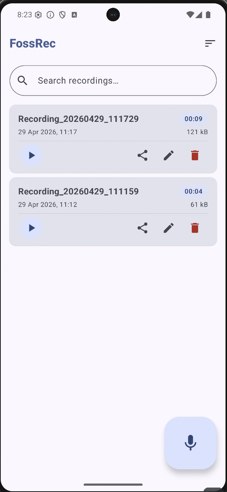

# FossRec

A minimal, private Android audio recorder. No internet. No accounts. No bullshit.

  
   
  <em>Screenshot placeholder — replace with actual screenshot</em>

---

## Why

Every audio recorder app I tried had at least one of these problems: unnecessary permissions, silent uploads to unknown servers, mandatory accounts, or hidden telemetry. So I built my own.

## Features

- Record audio from the microphone
- Files saved **locally** on device — nothing leaves your phone
- No internet permission
- No account, no cloud, no tracking

## Built With

- Kotlin
- Android native (no third-party SDKs)
- Gradle Kotlin DSL

## License

TBD — all rights reserved for now.
